# Rocket Elevators Information System 


Application for website of the Company of Rocket Elevators
1. In this weeks requirement we were task with elevating our static site and turn it into a web application on MVC (Model - View - Controller) Ruby on Rails Application
      - create the partials for rails (Headers and Footers)
      - create the routes (see section 8.)
      - convert static .html pages to .html.rb
      - create controllers


2. Running a rails server throught linux using Ubuntu
3. Setting Database with Mysql and Postgresql ( even thought we didnt use it this week(Postgresql)) 
4. Creating Database in Mysql and linking it to the Application 
5. Setting a Back office to the site using Gems (see section 10.) and added
      - Login In in Nav bar
      - Admin page in Nav bar
      - Employees in Admin section
      - Users in Admin section
      - Quotes in Admin section


6. Using the Database with Rails
7. Accessing the admin section
8. Routes.rb
9. URL for our site http://rocketmax.xyz/
10. Gem used
11. Diagram
12. Video link

- week 4 https://youtu.be/1h2rkXGJY-c

- week 5 https://youtu.be/9A7IXR1kIfo
13. Team


1 -  Ruby on Rails to convert a static page you need to adapt it to ruby by doing
some conversion to your static page. we used this link a lot to help us out at first
https://tatyanacodes.wordpress.com/2015/07/30/static-website-to-ruby-on-rails-web-application/
We build some partials which are in charge of loading the footers and headers for all pages


2 - Linux terminal for windows where all the magic happens this week. Within this terminal is where you will enable your rails server like so
- type in the terminal : rails server (keep in mind for this to work you should have Ubuntu, rails, ruby, mysql and postgresql installed)


3 - installing mysql on ubuntu  https://www.digitalocean.com/community/tutorials/how-to-install-mysql-on-ubuntu-18-04

4 - for creating tables in mysql with mondels
- rails g model tableName
- once the table created you need to upload them through migration
- rails db:drop
- rails db:create
- rails db:migrate
- rails db:seed ( used to populate your database if needed)


5 - Ruby on rails Back office was produced using mainly 2 gems rails-admin et devise
- devise was mainly used for the signin, signup and log in
- rails-admin for the admin section the whole back office


6 - To access the database from the rails server 
- rails c
- Hirb.enable
- User.all to query the users
- exit to exit the console


7 - 📚 Instructions to acces to the admin panel:


To log as Admin:
```
1. click the log in the nav bar
2. Username:admin@admin.com
3. password: 123456
4. click on the admin button in nav bar
```
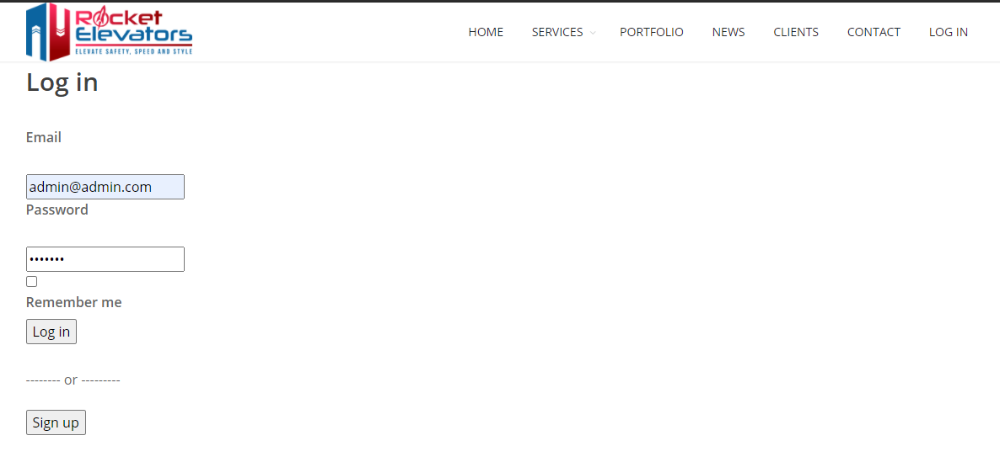

8 - Routes is the backbone that directs the application to different pages using controllers


9 - you can access our live site @
https://rocketmax.xyz/

10 - Gems used 
* gem 'devise'
      https://github.com/heartcombo/devise

* gem 'rails-admin'
      https://github.com/sferik/rails_admin/

* gem 'faker'
      https://github.com/faker-ruby/faker

* gem 'rubocop'
      https://github.com/rubocop-hq/rubocop

* gem 'sprockets-rails'
      https://github.com/rails/sprockets-rails/

* gem 'hirb'
      http://tagaholic.me/hirb/doc/index.html

      to use open  
            -open rails console in terminal
            -run : Hirb.enable ( everytime you open the console)

* gem 'cancancan'
      https://github.com/CanCanCommunity/cancancan added week 5

* gem 'pg'
      https://github.com/ged/ruby-pg added week 5

* gem 'multiverse'
      https://github.com/ankane/multiverse added week 5

* gem 'rails_admin_import', '~> 2.2'
      https://github.com/stephskardal/rails_admin_import added week 5

* gem 'chartkick'
      https://github.com/ankane/chartkick added week 5

* gem 'groupdate'
      https://github.com/ankane/groupdate added week 5

11 - The final product of our database for this week with its association represented in a Diagram (https://dbdiagram.io/)


12 - Link to our Video for week 4
https://youtu.be/1h2rkXGJY-c


# Rocket Elevators Information System 
# Week 5


During this week, participants are exposed to a more elaborate data model and must perform basic query exercises. They will be asked to create tables, alter them and extend the concepts managed by their information system.
Two types of databases will be requested for this exercise
A relational database
A data warehouse for decision-making

1. create a link to the postgresql database
2. tables added in mysql
- address
- leads
- customers
- buildings
- building_details
- batteries
- columns
- elevators


3. postgresql is going to be our data warehouse for decision-making


- to connect to your postgresql DB you nees to start it with this command line: 
**sudo service postgresql start/stop/status**


4.  also to  create and migrate tables its very similar to mysql except you add  DB=nameOfDatabase: 

- **DB=dwh rails db:create**
- **DB=dwh rails db:migrate**

5. the tables created for postgres
- FactQuotes
- FactContact
- FactElevator
- DimCustomers


6. updated Admin section with charts and new tables mysql and postgresql

7. Rake tasks

  Rake tasks are custom build executable files that we are using to populate the postgresql database (Dwh) from our seeded data and submit data from web pages (quotes and contact us forms). Within theses task we establish a connection to our mysql DB and postgres DB, 
  
 

      (actual data to  connect is in the rake file not the read me)
This is an example of a rake task

  ``` Ruby
  desc "Import data from Quote Table to Fact Quote Table"
  task quotes: :environment do
    dwh = PG::Connection.new(host: 'localhost', port: port, dbname: "dbname", user: "user", password: "password")
    puts "lead table to fact_quote table"
    
    dwh.exec("TRUNCATE fact_quotes")

    dwh.prepare('to_fact_quotes', 'INSERT INTO fact_quotes (quote_id, creation, company_name, email, nb_elevator, created_at, updated_at) VALUES ($1, $2, $3, $4, $5, CURRENT_TIMESTAMP, CURRENT_TIMESTAMP)')
    Quote.all.each do |quotes|
      dwh.exec_prepared('to_fact_quotes', [quotes.id, quotes.created_at, quotes.quotes_company_name, quotes.quotes_email, quotes.elevator_amount])
    end
  end 
  ```

8. File attachement in the contact us form was also added and supports all types of files. the filename can be seen in the admin section of the leads table and in the database.

9. Charts were added in the admin panel through chartskick
10. updated routes week 5


11. week 5 video link :  https://youtu.be/9A7IXR1kIfo

 


 OUR TEAM !!!!!
- Adrien Gobeil
- Charles Hall
- Eric Turcotte
- Jean-Francois Taillefer
- Maxime Auger

read me created by jean-francois taillefer


-----------------------------------------------------------------------------------------------
# Rocket Elevators Information System 


## CodeBoxx Odissey - Week 7 - Life is a Web Service

-----------------------------------------------------------------------------------------------

### OUR TEAM:
- Adrien Gobeil
- Daniela Grumbach Kinder
- Etienne Gonthier-Lapointe
- Maxime Auger
- Shaphan Charles

-----------------------------------------------------------------------------------------------

To improve Rocket Elevators service and products offering, we implemented seven APIs, which will are some of the most used products on the market:
* Google Maps
* Twilio
* Slack
* DropBox
* SendGrid
* IBM Watson
* ZenDesk
* Spotfy

-----------------------------------------------------------------------------------------------

Gems used 

* gem 'figaro'
      https://rubygems.org/gems/figaro/versions/1.1.1

* gem 'rails_admin_google_map'
      https://rubygems.org/gems/rails_admin_google_map

* gem 'sendgrid-ruby'
      https://rubygems.org/gems/sendgrid-ruby

* gem 'ibm_watson'
      https://rubygems.org/gems/ibm_watson

* gem "zendesk_api"
      https://rubygems.org/gems/zendesk_api

* gem 'rspotify'
      https://rubygems.org/gems/rspotify

* gem 'rack-cors'
      https://rubygems.org/gems/rack-cors

* gem 'active_model_serializers'
      https://rubygems.org/gems/active_model_serializers

* gem 'twilio-ruby'
      https://rubygems.org/gems/twilio-ruby

* gem 'slack-notifier'
      https://rubygems.org/gems/slack-notifier

* gem 'dropbox_api'
      https://rubygems.org/gems/dropbox_api

* gem "recaptcha", '~> 5.7'
      https://rubygems.org/gems/recaptcha


-----------------------------------------------------------------------------------------------

># [Google Maps](https://www.google.com/maps) 

Google Maps from now on is used as an extension within our secure back office (reserved for Rocket Elevators employees) in order to geolocate our customers buildings on a map and display statistics on a location:
* Location of the Buildings
* Number of floors in the building (If the information is available)
* Client name
* Number of Batteries
* Number of Columns
* Number of Elevators
* Full name of technical contact

The geolocation page must be a page in the Admin section of the website, available only to authenticated members.


-----------------------------------------------------------------------------------------------
># [Twilio](https://www.twilio.com/)  

Twilio’s API supports virtually all forms of communication within an application and allows integration of communications between diverse experiences regardless of the platforms on which they were built.

For Rocket Elevators, Twilio can be used to allow the platform to get in touch with the technicians in case of problems.

If the status of an Elevator in the database changes to "Intervention" status, the building's technical contact must be identified and an SMS must be sent to the telephone number associated with this contact.

In this case, the designated contact must be the coach assigned to each team, and he must receive the alerts on his mobile phone.


-----------------------------------------------------------------------------------------------
># [Slack](https://slack.com/intl/pt-br/)  

Rocket Elevators greatly benefit from synergy between all of the company's collaborators by using the very open and flexible Slack API.

The Backoffice in particular is able to publish messages on Slack to leave written records and inform about certain events that occur through its infrastructure.

In the current use case, when a controller changes the status of an elevator, this status is reflected in the information system and persists in the operational database . When these status changes occur, a message is sent to the slack: 

**“elevator_operations” channel to leave a written record."**

The written message must have the following format:

The Elevator **[Elevator’s ID]** with Serial Number **[Serial Number]** changed status from **[Old Status]** to **[New Status]**


-----------------------------------------------------------------------------------------------
># [Dropbox](https://www.dropbox.com/)  


  Dropbox website and account informations: 
  - Webpage: https://www.dropbox.com/
  - Login: rocketelevators2@gmail.com
  - Password: Pa$$w0rd!!


Dropbox API and its online storage allows Rocket Elevators to archive their documents in the clouds in a simple and flexible way while allowing access to the file from anywhere thanks to the multiple interfaces provided by Dropbox.

When a contact becomes a customer, that is to say when the “Customers” table in the information system can be linked to a record in the “Leads” table, which itself offers the possibility of uploading files in a binary field of the table, it is necessary to trigger an archiving procedure which: 

1. Connect to the Rocket Elevators DropBox account
2. Create a directory in DropBox on behalf of the client if the client does not already exist
3. Extract the file stored in the binary field of the MySQL database
4. Copy this file to the client DropBox directory
5. If the document is successfully downloaded to Dropbox, the controller deletes the content of the binary field from the database to avoid duplication

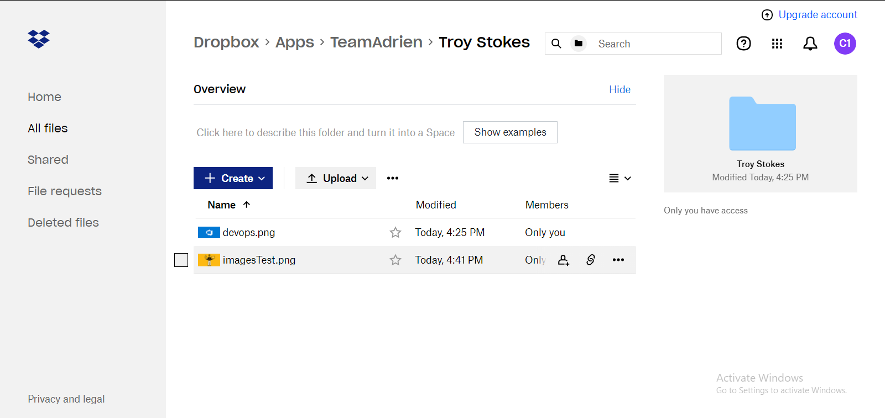

-----------------------------------------------------------------------------------------------
># [SendGrid](https://sendgrid.com/)  
Sendgrid
--------
__1. Gems installed__ 

`gem 'sendgrid-ruby'`
<br />
*This library allows you to quickly and easily use the Twilio SendGrid Web API v3 via Ruby.*

`gem 'figaro'`
<br />
*The gem reads a config/application.yml file and sets environment variables before anything else is configured in the Rails application.*

In your terminal, don't forget to install the gems
<br />
`bundle install`

<br />

__2. Sengrid account | Gmail account__

 | 
------------ | -------------
Sendgrid website: https://sendgrid.com | Gmail website: https://www.gmail.com
Sendgrid account email: rocketmax.xyz@gmail.com | Gmail account email: Rocketmax.xyz@gmail.com
Sendgrid account password: R0cketm4x.xyz2021 | Gmail account password : R0cketm4x.xyz

<br />

2.a. Sendgrid image url

Upload a logo that can be used in the email

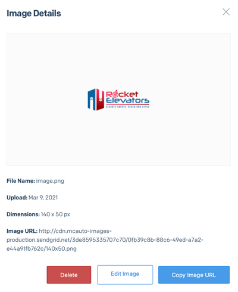

<br />

2.b. Sendgrid API key

Create an API key through the website of Sendgrid


<br />

__3. Insert the Sendgrid API key__

Create application.yml inside the /config folder and insert
`SENDGRID_API_KEY : Your_API_key`


<br />

3.a. WARNING

Never upload your API key on your GitHub. To avoid this, add application.yml in .gitignore

`/config/application.yml`

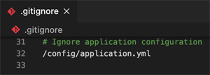

<br />

__4. The method__ 

https://github.com/sendgrid/sendgrid-ruby

4.a. The method is coded inside the leads_controller.rb file.

```
require 'sendgrid-ruby'
include SendGrid
require 'json'

def sendgrid
      from = Email.new(email: 'Rocketmax.xyz@gmail.com')
      subject = 'We thank you for contacting Rocket Elevators'
      to = Email.new(email: lead_params[:email])
      content = Content.new(type: 'text/html', value: 
      "<html>
            <body>
                  <p>Greetings #{lead_params[:full_name]},</p>
                  <p>We thank you for contacting Rocket Elevators to discuss the opportunity to contribute to your project #{lead_params[:project_name]}.</p>
                  <p>A representative from our team will be in touch with you very soon. We look forward to demonstrating the value of our solutions and helping you choose the appropriate product given your requirements.</p><br/>
                  <p style='color:#0b64a0;'>We’ll Talk soon,</p>
                  <p style='color:b10b1b;'>The Rocket Elevators Team</p>
                  
                  <p>Address: 4468 Wellington St Suite 204, Verdun, Québec H4G 1W5<br/>
                  Phone: (418) 555-1234<br/>
                  Email: info@codeboxx.biz<br/>
                  This is an automated message, please do not reply</p>
                  <hr/>
            </body>
      </html>")
      mail = SendGrid::Mail.new(from, subject, to, content)
      # puts JSON.pretty_generate(mail.to_json)
      puts mail.to_json

      sg = SendGrid::API.new(api_key: ENV['SENDGRID_API_KEY'])
      response = sg.client.mail._('send').post(request_body: mail.to_json)
      puts response.status_code
      puts response.body
      puts response.headers
end
```

4.b. `lead_params[:email]` `lead_params[:full=name]` `lead_params[:email]` are called from the `lead_params` method and used to personalize the email.

4.c. `sendgrid()` method is called after the `fact_contnact` method when the `@lead.save!` occure.

```
   @lead.save!
        if @lead.save
            fact_contacts()
            sendgrid()
            ...
```

<br />

__5. Fill up the 'contact us' form__

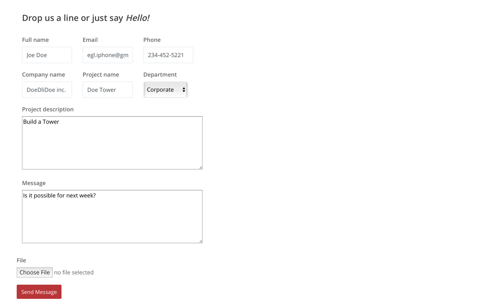

<br />

__6. Email received__

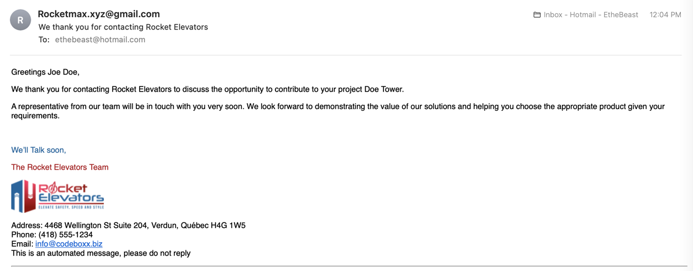

-----------------------------------------------------------------------------------------------
># [IBM Watson](https://www.ibm.com/watson)  

IBM through its Artificial Intelligence Watson provides application developers with many services. Among the most used, there is a Text-to-Speech functionality which can be used on a multitude of platforms.

With IBM Watson, Rocket Elevators adds text-to-speech functionality to their Home Dashboard (/ admin). Everytime the Admin Dashboard page appears, there is the option to start the briefing.

The type of information that speech synthesis allows are the following:

1. Greetings to the logged users
2. There are currently XXX elevators deployed in the XXX buildings of your XXX customers
3. Currently, XXX elevators are not in Running Status and are being serviced
4. You currently have XXX quotes awaiting processing
5. You currently have XXX leads in your contact requests
6. Batteries are deployed across XXX cities

To provide the type of voice summary described, it is necessary to execute the appropriate queries in the database to collect the relevant data. Then it forms sentences in English and combine them with the data collected.


-----------------------------------------------------------------------------------------------

Bonus 2/4:
------

># [Star Wars](https://www.starwars.com/)  

Use of IBM Watson to say messages from the film Star Wars, automatically and randomly generated using the gem Faker.


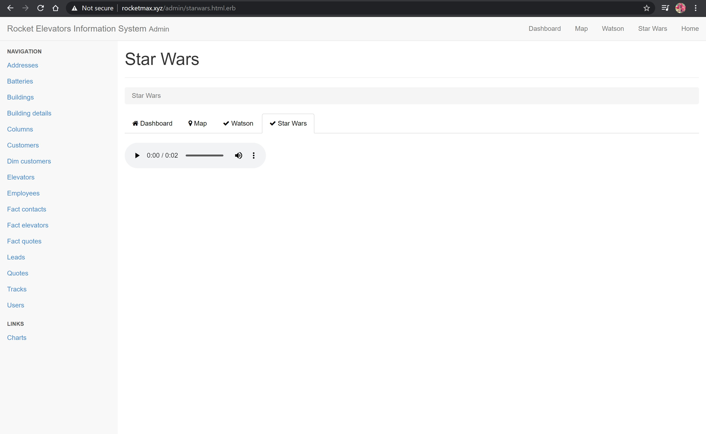


-----------------------------------------------------------------------------------------------
># [ZenDesk](https://www.zendesk.com/)  

  ZenDesk website and account informations: 
  - Webpage: https://www.zendesk.com/
  - Account name:  Rocket Elevators
  - Primary email: danigrum@gmail.com
  - Password: rocketelevators
  - Organization: Rocket Elevators
  - Rocket Elevators ZenDesk page: https://rocketelevators2021.zendesk.com/

The ZenDesk platform can be powered by a call to the API and the software can then process requests depending on the type.

* The website's “Contact Us” form creates a new “Question” type ticket in ZenDesk


* The website's “Get a Quote” form creates a new “Task” type ticket in ZenDesk


* The tickets created are visible in the ZenDesk Console and it is possible to respond to them or even manage a workflow for these contacts.


The content of each ticket created must include the contact information which has been stored in the database:

Subject: **[Full Name]** from **[Company Name]**

Comment: The contact **[Full Name]** from company **[Company Name]** can be reached at email  **[E-Mail Address]** and at phone number **[Phone]**. **[Department]** has a project named **[Project Name]** which would require contribution from Rocket Elevators. 

**[Project Description]**

Attached Message: **[Message]**

The Contact uploaded an attachment


-----------------------------------------------------------------------------------------------

Bonus 1/4:
------

># [Spotify](https://www.spotify.com/us/)  

Spotify API allows to listen to music when logged in on the backoffice.


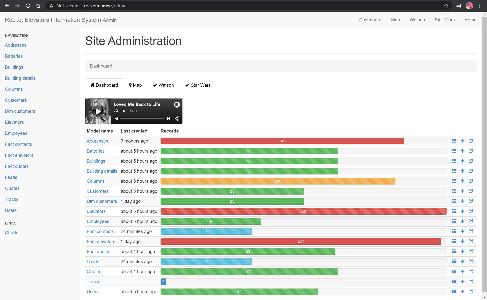

-----------------------------------------------------------------------------------------------

Bonus 3/4:
------

># [reCAPTCHA](https://www.google.com/recaptcha/about/) 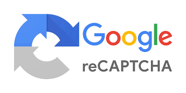 

ReCAPTCHA is an service that helps protect Rocket Elevators website from spam and abuse, is a test to tell human and robots apart.

It is implemented in the Contact Us and Quote forms.

ReCAPTCHA on Contact Us form:
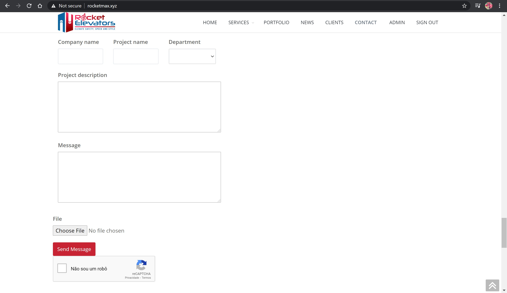

ReCAPTCHA on Quote form:
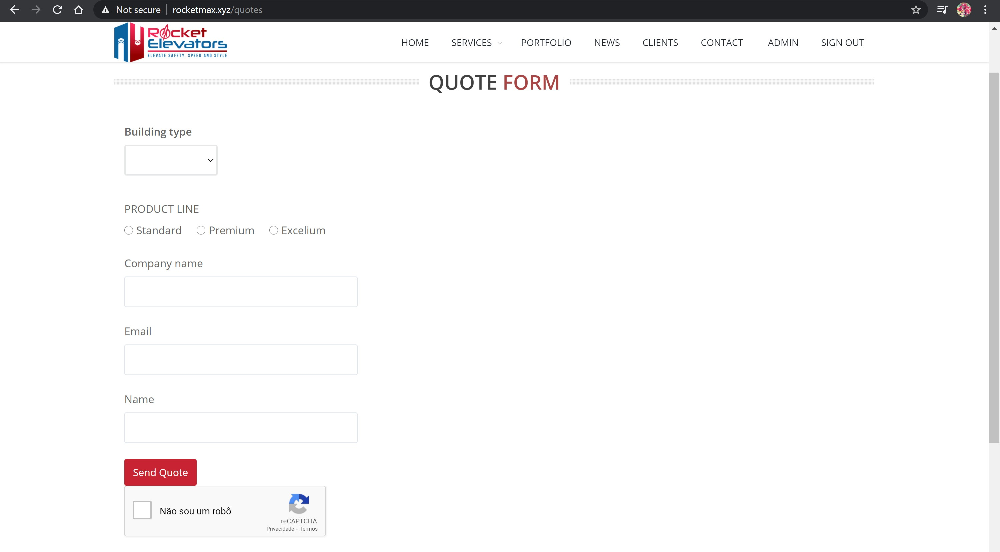

-----------------------------------------------------------------------------------------------

Bonus 4/4:
------

># [reCAPTCHA](https://www.google.com/recaptcha/about/)  

jfa jeaojfoaejf oa


-----------------------------------------------------------------------------------------------


